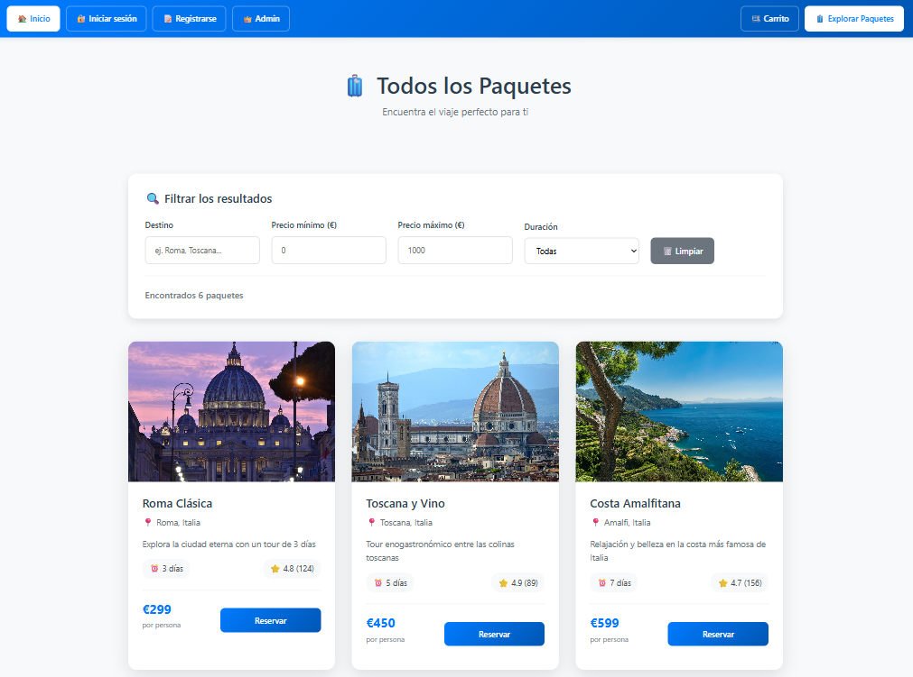

# Travel Agency - Online Booking Platform

A web application that simulates an online travel agency where users can purchase all-inclusive travel packages and share their travel experiences with the community.

**Team Contributors**:

This project was developed as a group project with:

- [ralunsebastian](https://github.com/ralunsebastian)
- [MatiCR6284](https://github.com/MatiCR6284)

## 🌍 Main Features

### 👥 Guest Users
- Home page
- Travel packages page with previews and details

### 🔑 Logged-in Users
- Community page to share travel experiences
- Shopping cart with checkout
- Ability to book travel packages
- Page "My Trips" to see and manage reservations

### 🛠️ Admin
- Dedicated admin access
- Ability to create new packages

## 🖥️ Frontend

Built with React

## ⚙️ Backend

The backend is built with Node and Express, connected to a PostgreSQL database.  

- Cart checkout
- User registration
- User login
- Community post creation
- Admin package creation

## Preview

